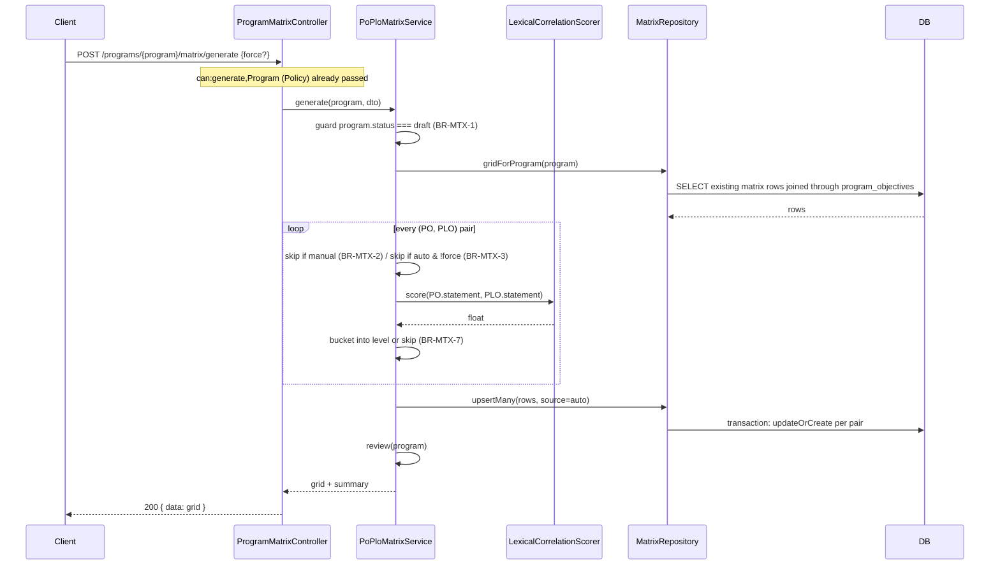

# PO–PLO Matrix Generation Engine

| | |
|---|---|
| **Document ID** | ARCH-0002 |
| **Role** | Software Architect deliverable |
| **Governing documents** | [ADR-0001](../adr/0001-system-architecture.md), [DB Design 0001](../database/0001-database-design.md), [ARCH-0001](0001-authentication-architecture.md) |
| **Implementation** | `backend/` — fully implemented, not aspirational |

## 0. What this is, plainly

This engine produces a first-draft correlation between each Program Objective (PO) and each Program Learning Outcome (PLO), then lets a human confirm or correct it. **It is a lexical-overlap heuristic, not semantic AI matching** — PAMS has no embeddings/LLM infrastructure, and pretending otherwise would be dishonest about what the system actually does. The generated matrix is explicitly a draft: every cell is tagged with its provenance (`auto` or `manual`) precisely so a reviewer knows what still needs human judgment, and the engine is built so a manual decision can never be silently overwritten by a later auto-run.

## 1. Business Rules

| ID | Rule |
|---|---|
| BR-MTX-1 | Matrix generation and manual edits are only permitted while the parent Program is in `draft` status (same principle as FR-PROG-02/BR-7 — reviewing/exporting is always allowed, mutating is not once the spec is frozen). |
| BR-MTX-2 | An auto-generation run **never** overwrites a cell whose current source is `manual` — a human decision is authoritative and sticky. |
| BR-MTX-3 | An auto-generation run only overwrites a previously `auto` cell when explicitly re-run with `force: true`; a plain run only fills gaps (cells with no entry at all). |
| BR-MTX-4 | Manual edits (single-outcome sync or bulk matrix edit) always set the cell's source to `manual`, permanently "promoting" it out of auto-suggestion territory. |
| BR-MTX-5 | `correlation_level` is always 1–3 (Low/Medium/High); the algorithm never invents a fourth bucket, and validation rejects anything outside that range regardless of entry path. |
| BR-MTX-6 | Both sides of a mapped pair (`objective_id`, `learning_outcome_id`) must belong to the *same* Program — enforced at both the request-validation layer and again inside the Service, since a Service must never assume the caller validated correctly (established pattern from ARCH-0001). |
| BR-MTX-7 | If the lexical algorithm finds zero word overlap between a PO and a PLO, it does **not** guess — the cell is left unmapped for a human to decide, rather than inventing a low-confidence correlation nobody asked for. |
| BR-MTX-8 | Review and export are read-only and carry no draft-status restriction — a QA Officer can review/export at any program status. |

## 2. Algorithm — Lexical Overlap Heuristic

For every `(PO, PLO)` pair not already blocked by BR-MTX-2/3:

1. **Tokenize** both statements: lowercase, strip everything but letters/digits, split on whitespace/punctuation.
2. **Filter**: drop a small stopword list (`the`, `a`, `an`, `and`, `or`, `of`, `to`, `in`, `on`, `will`, `be`, `is`, `are`, `that`, `this`, `with`, `by`, `for`, `as`, `at`, `from`, `their`, `which`, `it`, `its`, …) and any token ≤ 2 characters. What remains is each statement's **significant word set**.
3. **Score**: an overlap-coefficient, not plain Jaccard — chosen because PO and PLO statements are often very different lengths, and Jaccard penalizes that unfairly:

   ```
   score(PO, PLO) = |significant_words(PO) ∩ significant_words(PLO)| / min(|significant_words(PO)|, |significant_words(PLO)|)
   ```

4. **Bucket** the score into a suggested `correlation_level`:

   | Score | Suggested level |
   |---|---|
   | `score = 0` | *(no entry — BR-MTX-7)* |
   | `0 < score < 0.25` | 1 (Low) |
   | `0.25 ≤ score < 0.5` | 2 (Medium) |
   | `score ≥ 0.5` | 3 (High) |

This lives in a single pure function (`LexicalCorrelationScorer::score()`), with no I/O and no framework dependency — it takes two strings and returns a float, which is what makes it unit-testable in isolation from the database and from Laravel entirely.

**Explicit limitation**: this catches *vocabulary* overlap, not synonyms or paraphrase ("apply theoretical knowledge" vs. "utilize academic concepts" would score 0 despite meaning something similar). That's the reason BR-MTX-7 refuses to guess on zero-overlap pairs instead of defaulting to Low, and the reason review is a first-class feature rather than an afterthought.

## 3. Data Flow

### 3.1 Generate



### 3.2 Manual edit / review / export

- **Manual edit**: `PUT /programs/{program}/matrix` → validated pairs → `PoPloMatrixService::bulkUpdate()` → same `MatrixRepository::upsertMany()` path, `source=manual` → BR-MTX-4 makes those cells immune to future auto-runs.
- **Review**: `GET /programs/{program}/matrix` → `PoPloMatrixService::review()` builds the full PO×PLO grid (every pair, mapped or not) plus a `summary` (`auto`/`manual`/`unmapped` counts) so a reviewer sees at a glance how much is still unconfirmed.
- **Export**: `GET /programs/{program}/matrix/export` → same grid, serialized to CSV and streamed as a file download. No new dependency: Laravel can stream CSV natively. (A PDF export can be added later using the PDF library already named as a future dependency in SRS-0001 §8.3 — not installed now since this deliverable didn't ask for a specific format and CSV needs zero new packages.)

## 4. Database Interaction

`objective_outcome_matrix` (existing table, extended — see DB Design §3.9) gains one column:

| Column | Type | Notes |
|---|---|---|
| `source` | `VARCHAR(10)`, default `manual` | `auto` \| `manual` — `App\Support\Enums\MatrixEntrySource`. Default `manual` because every row that already existed before this engine was created by the explicit per-outcome sync endpoint (ARCH-style manual action), so backfilling them as `manual` is factually correct, not just a safe default. |

**Access pattern**: `objective_outcome_matrix` has no `program_id` of its own (by design — DB Design §9.3, avoiding a redundant denormalized FK); every program-scoped query joins through `program_objective_id → program_objectives.program_id`. `MatrixRepository::gridForProgram()` does this once per request via `whereHas`, not once per pair, keeping it a single query regardless of matrix size.

**Write pattern**: both `generate()` and `bulkUpdate()` funnel through one repository method, `upsertMany()`, which wraps every pair in `DB::transaction()` and uses `updateOrCreate` per pair (not a raw multi-row upsert) — deliberately, since PAMS's realistic matrix size (a handful of POs × PLOs per program) makes N `updateOrCreate` calls fast enough, and staying on Eloquent keeps casts (the `source` enum) and any future model events working, which a raw `DB::table()->upsert()` would silently bypass.

## 5. Laravel Implementation

**The one rule that shapes everything below**: matrix logic lives only in `app/Domain/LearningOutcome/{Services,Repositories}` — Controllers validate-and-delegate, and nothing in Filament or the (not-yet-built) React app touches this logic at all; both would call the same `PoPloMatrixService` the API Controller calls, never re-implement any part of the algorithm or the business rules.

| Layer | File | Responsibility |
|---|---|---|
| Algorithm | `app/Domain/LearningOutcome/Services/Support/LexicalCorrelationScorer.php` | Pure scoring function — §2 |
| Model | `app/Domain/LearningOutcome/Models/ObjectiveOutcomeMatrix.php` | One row = one PO×PLO cell, with `source` |
| Repository | `MatrixRepositoryInterface` / `MatrixRepository` | `gridForProgram()`, `upsertMany()` — §4 |
| Service | `PoPloMatrixService` | `generate()`, `review()`, `bulkUpdate()`, `exportCsv()` — every business rule in §1 |
| Policy | `MatrixPolicy` (explicitly registered via `Gate::policy()` in `AppServiceProvider`, not auto-discovered — see class docblock for why) | `view`/`generate`/`update`/`export` abilities, same admin/qa_officer/assigned-coordinator shape as `LearningOutcomePolicy` |
| DTOs | `GenerateMatrixDTO`, `BulkUpdateMatrixDTO` | Typed input crossing the Controller→Service boundary |
| Requests | `GenerateMatrixRequest`, `UpdateMatrixRequest` | Format validation + cross-program existence checks (BR-MTX-6) |
| Controller | `ProgramMatrixController` | Four thin methods: `review`, `generate`, `update`, `export` — no business logic |
| Routes | `routes/api/v1/matrix.php` | `GET/POST/PUT/{export}` under `/programs/{program}/matrix` |

### Endpoints

| Method | Path | Ability | Purpose |
|---|---|---|---|
| `GET` | `/api/v1/programs/{program}/matrix` | `view` | Review: full grid + summary |
| `POST` | `/api/v1/programs/{program}/matrix/generate` | `generate` | Auto-generate (fill gaps, or `force: true` to refresh prior `auto` cells) |
| `PUT` | `/api/v1/programs/{program}/matrix` | `update` | Manual bulk edit — always `source=manual` |
| `GET` | `/api/v1/programs/{program}/matrix/export` | `export` | CSV download of the current grid |
