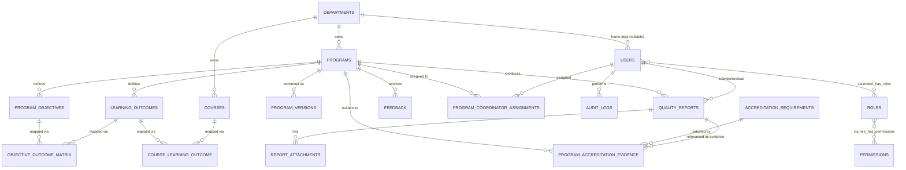

# PAMS Database Design (MySQL, 3NF)

| | |
|---|---|
| **Document ID** | DB-0001 |
| **Role** | Database Architect deliverable |
| **Governing documents** | [ADR-0001](../adr/0001-system-architecture.md), [Requirements Analysis 0001](../analysis/0001-requirements-analysis.md), [SRS-0001](../srs/0001-software-requirements-specification.md) |
| **Status** | Draft for review — **no migrations generated yet** |

This document defines the logical MySQL schema for PAMS, normalized to Third Normal Form (3NF), following ADR-0001 §4 (UUID PKs on domain tables, snake_case plural table names, explicit FK naming, timestamp/soft-delete conventions). No Laravel migration code is included by design — this is the schema specification those migrations will later implement.

---

## 1. ER Diagram Description

### 1.1 Narrative

At the center is **`programs`**, owned by a **`department`**. Each program has:

- Many **`program_objectives`** (Program Educational Objectives / PEOs).
- Many **`learning_outcomes`** (Program Learning Outcomes / PLOs).
- A many-to-many relationship between its objectives and outcomes, resolved by the **`objective_outcome_matrix`** table (the "PO-PLO Matrix"), carrying a `correlation_level`.
- Many-to-many mapping between `learning_outcomes` and the institution-wide **`courses`** catalog, resolved by **`course_learning_outcome`** (the Course/Curriculum Mapping Matrix), carrying a `mapping_level`.
- Many-to-many linkage to the institution-wide **`accreditation_requirements`** catalog, resolved by **`program_accreditation_evidence`**, carrying evidence status/description.
- Many **`quality_reports`** (one per reporting period per program), each optionally holding **`report_attachments`**.
- Many **`feedback`** entries (student/employer/alumni/faculty input).
- A version trail in **`program_versions`**, snapshotting the specification each time an approved program changes.
- Many assigned coordinators via **`program_coordinator_assignments`** (resolves `users` ↔ `programs`).

**`users`** carry role/permission assignments through the standard `roles` / `permissions` / `model_has_roles` / `model_has_permissions` / `role_has_permissions` tables (RBAC, per ADR-0001 §8). All significant state transitions (submit/approve/reject) are recorded in the append-only **`audit_logs`** table, referencing the acting user and the affected entity.

### 1.2 Diagram (Mermaid ER notation)

---

## 2. Entity Overview

| # | Entity (table) | Domain grouping | PK type |
|---|---|---|---|
| 1 | `departments` | Reference/lookup | Auto-increment |
| 2 | `users` | Identity & Access | ULID |
| 3 | `roles` | Identity & Access (Spatie) | Auto-increment |
| 4 | `permissions` | Identity & Access (Spatie) | Auto-increment |
| 5 | `model_has_roles` | Identity & Access (Spatie pivot) | Composite |
| 6 | `model_has_permissions` | Identity & Access (Spatie pivot) | Composite |
| 7 | `role_has_permissions` | Identity & Access (Spatie pivot) | Composite |
| 8 | `programs` | Program Core | ULID |
| 9 | `program_coordinator_assignments` | Program Core (pivot) | Auto-increment |
| 10 | `program_versions` | Program Core (audit) | ULID |
| 11 | `program_objectives` | Curriculum ("Objectives" / PEOs) | ULID |
| 12 | `learning_outcomes` | Curriculum (PLOs) | ULID |
| 13 | `objective_outcome_matrix` | Curriculum (PO-PLO Matrix, pivot+metadata) | Auto-increment |
| 14 | `courses` | Curriculum | ULID |
| 15 | `course_learning_outcome` | Curriculum (Course Mapping, pivot+metadata) | Auto-increment |
| 16 | `accreditation_requirements` | Accreditation | ULID |
| 17 | `program_accreditation_evidence` | Accreditation (pivot+metadata) | ULID |
| 18 | `quality_reports` | Reports | ULID |
| 19 | `report_attachments` | Reports | ULID |
| 20 | `feedback` | Feedback | ULID |
| 21 | `audit_logs` | Cross-cutting | Auto-increment |

**PK strategy rationale (per ADR-0001 §4):** domain entities that are individually referenced across modules, exported, or user-facing use **ULID** (`CHAR(26)`). Pure lookup tables (`departments`) and package-standard/high-volume append-only or junction tables (`roles`, `permissions`, their pivots, `objective_outcome_matrix`, `course_learning_outcome`, `program_coordinator_assignments`, `audit_logs`) use **auto-increment** — they are never referenced externally (no accreditation export, no cross-institution sharing) and benefit from smaller, sequential index footprints.

---

## 3. Entities & Attributes

### 3.1 `departments`
| Attribute | Type | Nullable | Notes |
|---|---|---|---|
| id | BIGINT UNSIGNED, AUTO_INCREMENT (PK) | No | |
| code | VARCHAR(20) | No | Unique |
| name | VARCHAR(150) | No | Unique |
| created_at / updated_at | TIMESTAMP | No | |

### 3.2 `users`
| Attribute | Type | Nullable | Notes |
|---|---|---|---|
| id | CHAR(26) ULID (PK) | No | |
| department_id | BIGINT UNSIGNED (FK) | Yes | Home department; QA/Admin may be null |
| name | VARCHAR(150) | No | |
| email | VARCHAR(191) | No | Unique |
| password | VARCHAR(255) | No | Hashed (bcrypt/Argon2) |
| is_active | BOOLEAN | No | Default `true`; FR-USR-03 |
| email_verified_at | TIMESTAMP | Yes | |
| created_at / updated_at / deleted_at | TIMESTAMP | deleted_at nullable | Soft delete — preserves audit trail of who approved what historically |

### 3.3 `roles`, `permissions`, and pivots (Spatie `laravel-permission` schema)
| Table | Attribute | Type | Notes |
|---|---|---|---|
| `roles` | id, name VARCHAR(125), guard_name VARCHAR(125) default `web`, timestamps | UNIQUE(name, guard_name) | Seeded with exactly 3 rows: `admin`, `qa_officer`, `program_coordinator` (ADR-0001 §8, immutable set) |
| `permissions` | id, name VARCHAR(125), guard_name, timestamps | UNIQUE(name, guard_name) | e.g. `program.approve`, `report.review` |
| `model_has_roles` | role_id (FK→roles), model_type VARCHAR(191), model_id CHAR(26) | PK(role_id, model_id, model_type) | Links `users` (and future models) to roles |
| `model_has_permissions` | permission_id (FK→permissions), model_type, model_id | PK(permission_id, model_id, model_type) | Direct permission grants (exception cases) |
| `role_has_permissions` | permission_id (FK→permissions), role_id (FK→roles) | PK(permission_id, role_id) | Role→permission matrix |

### 3.4 `programs`
| Attribute | Type | Nullable | Notes |
|---|---|---|---|
| id | CHAR(26) ULID (PK) | No | |
| department_id | BIGINT UNSIGNED (FK) | No | |
| code | VARCHAR(30) | No | Unique |
| name | VARCHAR(200) | No | |
| level | VARCHAR(20) | No | `diploma`\|`bachelor`\|`master`\|`phd` — string-backed enum, CHECK constrained |
| description | TEXT | Yes | |
| duration_years | TINYINT UNSIGNED | No | |
| status | VARCHAR(20) | No | `draft`\|`submitted`\|`approved` — default `draft`, CHECK constrained (FR-PROG-03/05/06) |
| current_version_no | INT UNSIGNED | No | Default 1; incremented on each approved revision (FR-PROG-08) |
| created_at / updated_at / deleted_at | TIMESTAMP | deleted_at nullable | |

### 3.5 `program_coordinator_assignments`
| Attribute | Type | Nullable | Notes |
|---|---|---|---|
| id | BIGINT UNSIGNED AUTO_INCREMENT (PK) | No | |
| program_id | CHAR(26) (FK→programs) | No | |
| user_id | CHAR(26) (FK→users) | No | |
| assigned_at | TIMESTAMP | No | |
| UNIQUE(program_id, user_id) | | | Prevents duplicate assignment; realizes BR-5/FR-PROG-09 |

### 3.6 `program_versions`
| Attribute | Type | Nullable | Notes |
|---|---|---|---|
| id | CHAR(26) ULID (PK) | No | |
| program_id | CHAR(26) (FK→programs) | No | |
| version_no | INT UNSIGNED | No | UNIQUE with program_id |
| snapshot_json | JSON | No | Point-in-time archival snapshot of the full specification (objectives, outcomes, mappings) at approval time — see §9.2 for normalization rationale |
| approved_by | CHAR(26) (FK→users) | No | |
| approved_at | TIMESTAMP | No | |
| created_at | TIMESTAMP | No | |

### 3.7 `program_objectives` ("Objectives" / PEOs)
| Attribute | Type | Nullable | Notes |
|---|---|---|---|
| id | CHAR(26) ULID (PK) | No | |
| program_id | CHAR(26) (FK→programs) | No | |
| code | VARCHAR(20) | No | e.g. `PEO1`; UNIQUE with program_id |
| statement | TEXT | No | |
| created_at / updated_at / deleted_at | TIMESTAMP | deleted_at nullable | |

### 3.8 `learning_outcomes` (PLOs)
| Attribute | Type | Nullable | Notes |
|---|---|---|---|
| id | CHAR(26) ULID (PK) | No | |
| program_id | CHAR(26) (FK→programs) | No | |
| code | VARCHAR(20) | No | e.g. `PLO1`; UNIQUE with program_id |
| statement | TEXT | No | |
| category | VARCHAR(1) | No | `A` Knowledge \| `B` Cognitive Skills \| `C` Practical Skills \| `D` General Skills — `App\Support\Enums\LearningOutcomeCategory` (FR-LO-02) |
| created_at / updated_at / deleted_at | TIMESTAMP | deleted_at nullable | |

### 3.9 `objective_outcome_matrix` (PO-PLO Matrix)
| Attribute | Type | Nullable | Notes |
|---|---|---|---|
| id | BIGINT UNSIGNED AUTO_INCREMENT (PK) | No | Surrogate key since row carries metadata (DBR-06) |
| program_objective_id | CHAR(26) (FK→program_objectives) | No | |
| learning_outcome_id | CHAR(26) (FK→learning_outcomes) | No | |
| correlation_level | TINYINT UNSIGNED | No | 1=Low, 2=Medium, 3=High — CHECK (1–3) |
| created_at / updated_at | TIMESTAMP | No | |
| UNIQUE(program_objective_id, learning_outcome_id) | | | One correlation entry per PEO×PLO pair |

### 3.10 `courses`
| Attribute | Type | Nullable | Notes |
|---|---|---|---|
| id | CHAR(26) ULID (PK) | No | |
| department_id | BIGINT UNSIGNED (FK→departments) | No | |
| code | VARCHAR(20) | No | Unique |
| title | VARCHAR(200) | No | |
| credit_hours | TINYINT UNSIGNED | No | |
| created_at / updated_at / deleted_at | TIMESTAMP | deleted_at nullable | Institution-wide catalog; independent of any single program so it can be reused across programs (avoids duplicating course data — see §9.3) |

### 3.11 `course_learning_outcome` (Course/Curriculum Mapping Matrix)
| Attribute | Type | Nullable | Notes |
|---|---|---|---|
| id | BIGINT UNSIGNED AUTO_INCREMENT (PK) | No | Surrogate key (row carries `mapping_level`) |
| course_id | CHAR(26) (FK→courses) | No | |
| learning_outcome_id | CHAR(26) (FK→learning_outcomes) | No | |
| mapping_level | VARCHAR(20) | No | `introduced`\|`reinforced`\|`mastered` — CHECK constrained (FR-CM-01) |
| created_at / updated_at | TIMESTAMP | No | |
| UNIQUE(course_id, learning_outcome_id) | | | Prevents duplicate mapping (FR-CM-03) |

### 3.12 `accreditation_requirements`
| Attribute | Type | Nullable | Notes |
|---|---|---|---|
| id | CHAR(26) ULID (PK) | No | |
| code | VARCHAR(30) | No | Unique |
| title | VARCHAR(200) | No | |
| description | TEXT | Yes | |
| standard_body | VARCHAR(150) | No | e.g. Libyan national QA authority name |
| created_at / updated_at / deleted_at | TIMESTAMP | deleted_at nullable | |

### 3.13 `program_accreditation_evidence`
| Attribute | Type | Nullable | Notes |
|---|---|---|---|
| id | CHAR(26) ULID (PK) | No | |
| program_id | CHAR(26) (FK→programs) | No | |
| accreditation_requirement_id | CHAR(26) (FK→accreditation_requirements) | No | |
| quality_report_id | CHAR(26) (FK→quality_reports) | Yes | Optional supporting report evidence |
| evidence_description | TEXT | Yes | |
| status | VARCHAR(20) | No | `pending`\|`satisfied` — default `pending`, CHECK constrained (FR-ACC-03/04) |
| created_at / updated_at | TIMESTAMP | No | |
| UNIQUE(program_id, accreditation_requirement_id) | | | One evidence record per program×requirement |

### 3.14 `quality_reports`
| Attribute | Type | Nullable | Notes |
|---|---|---|---|
| id | CHAR(26) ULID (PK) | No | |
| program_id | CHAR(26) (FK→programs) | No | |
| period_label | VARCHAR(30) | No | e.g. `2025-Fall` |
| status | VARCHAR(20) | No | `draft`\|`submitted`\|`approved` — default `draft`, CHECK constrained |
| summary | TEXT | No | |
| submitted_by | CHAR(26) (FK→users) | Yes | |
| submitted_at | TIMESTAMP | Yes | |
| reviewed_by | CHAR(26) (FK→users) | Yes | |
| reviewed_at | TIMESTAMP | Yes | |
| rejection_reason | TEXT | Yes | Required by app logic when status returns to draft after rejection (FR-QR-04) |
| pdf_path | VARCHAR(255) | Yes | Populated on approved export (FR-QR-06) |
| created_at / updated_at / deleted_at | TIMESTAMP | deleted_at nullable | |
| UNIQUE(program_id, period_label) | | | One row per program×period — the report is edited/resubmitted in place across draft→submitted→approved/back-to-draft, which naturally enforces BR-8 (no duplicate open report per period) at the DB level |

### 3.15 `report_attachments`
| Attribute | Type | Nullable | Notes |
|---|---|---|---|
| id | CHAR(26) ULID (PK) | No | |
| quality_report_id | CHAR(26) (FK→quality_reports) | No | |
| file_path | VARCHAR(255) | No | Stored outside public root / signed URL (SEC-07) |
| file_name | VARCHAR(150) | No | |
| mime_type | VARCHAR(100) | No | Validated against allowlist (SEC-06) |
| uploaded_by | CHAR(26) (FK→users) | No | |
| created_at | TIMESTAMP | No | |

### 3.16 `feedback`
| Attribute | Type | Nullable | Notes |
|---|---|---|---|
| id | CHAR(26) ULID (PK) | No | |
| program_id | CHAR(26) (FK→programs) | No | |
| source_type | VARCHAR(20) | No | `student`\|`employer`\|`alumni`\|`faculty` — CHECK constrained |
| submitted_by | CHAR(26) (FK→users) | Yes | Null for external respondents without an account |
| respondent_name | VARCHAR(150) | Yes | Used when `submitted_by` is null |
| respondent_email | VARCHAR(191) | Yes | |
| rating | TINYINT UNSIGNED | Yes | 1–5, CHECK constrained |
| comments | TEXT | Yes | |
| status | VARCHAR(20) | No | `new`\|`reviewed`\|`actioned` — default `new`, CHECK constrained |
| created_at / updated_at | TIMESTAMP | No | |

### 3.17 `audit_logs`
| Attribute | Type | Nullable | Notes |
|---|---|---|---|
| id | BIGINT UNSIGNED AUTO_INCREMENT (PK) | No | High-volume, append-only |
| user_id | CHAR(26) (FK→users) | Yes | Null permitted for system-initiated actions |
| action | VARCHAR(60) | No | e.g. `program.approved`, `report.rejected` (SEC-10) |
| entity_type | VARCHAR(60) | No | e.g. `Program`, `QualityReport` |
| entity_id | CHAR(26) | No | Not an FK — target table varies by `entity_type` (see §9.4) |
| reason | TEXT | Yes | Rejection/approval comments |
| metadata | JSON | Yes | Additional context (e.g., field diffs) |
| created_at | TIMESTAMP | No | Default `CURRENT_TIMESTAMP` |

---

## 4. Primary Keys

| Strategy | Applies to | Rationale |
|---|---|---|
| **ULID** `CHAR(26)` | `users`, `programs`, `program_versions`, `program_objectives`, `learning_outcomes`, `courses`, `accreditation_requirements`, `program_accreditation_evidence`, `quality_reports`, `report_attachments`, `feedback` | ADR-0001 §4 mandate for domain entities; safe for external accreditation exports, no sequential-ID enumeration exposure |
| **Auto-increment** `BIGINT UNSIGNED` | `departments`, `roles`, `permissions`, `objective_outcome_matrix`, `course_learning_outcome`, `program_coordinator_assignments`, `audit_logs` | Lookup tables and internal-only junction/log tables never referenced outside the system (ADR-0001 §4 carve-out) |
| **Composite** | `model_has_roles`, `model_has_permissions`, `role_has_permissions` | Spatie `laravel-permission` package standard schema |

---

## 5. Foreign Keys

| Child table.column | Parent table.column | ON DELETE | ON UPDATE | Rationale |
|---|---|---|---|---|
| users.department_id | departments.id | RESTRICT | CASCADE | Prevent orphaning users by deleting a department in use |
| programs.department_id | departments.id | RESTRICT | CASCADE | Same |
| courses.department_id | departments.id | RESTRICT | CASCADE | Same |
| program_coordinator_assignments.program_id | programs.id | CASCADE | CASCADE | Assignment meaningless without the program |
| program_coordinator_assignments.user_id | users.id | CASCADE | CASCADE | Same |
| program_versions.program_id | programs.id | CASCADE | CASCADE | Version history owned entirely by the program |
| program_versions.approved_by | users.id | RESTRICT | CASCADE | Preserve audit identity; block deleting a user with approval history (use `is_active=false` instead — FR-USR-03) |
| program_objectives.program_id | programs.id | CASCADE | CASCADE | Owned child data |
| learning_outcomes.program_id | programs.id | CASCADE | CASCADE | Owned child data |
| objective_outcome_matrix.program_objective_id | program_objectives.id | CASCADE | CASCADE | Mapping meaningless without the objective |
| objective_outcome_matrix.learning_outcome_id | learning_outcomes.id | CASCADE | CASCADE | Mapping meaningless without the outcome |
| course_learning_outcome.course_id | courses.id | RESTRICT | CASCADE | Protect shared course catalog — remove mappings explicitly before deleting a course |
| course_learning_outcome.learning_outcome_id | learning_outcomes.id | CASCADE | CASCADE | Mapping owned by the outcome |
| program_accreditation_evidence.program_id | programs.id | CASCADE | CASCADE | Owned child data |
| program_accreditation_evidence.accreditation_requirement_id | accreditation_requirements.id | RESTRICT | CASCADE | Protect shared requirements catalog |
| program_accreditation_evidence.quality_report_id | quality_reports.id | SET NULL | CASCADE | Evidence record survives even if the linked report reference is cleared |
| quality_reports.program_id | programs.id | CASCADE | CASCADE | Owned child data |
| quality_reports.submitted_by / reviewed_by | users.id | RESTRICT | CASCADE | Preserve audit identity |
| report_attachments.quality_report_id | quality_reports.id | CASCADE | CASCADE | Attachment meaningless without the report |
| report_attachments.uploaded_by | users.id | RESTRICT | CASCADE | Preserve audit identity |
| feedback.program_id | programs.id | CASCADE | CASCADE | Owned child data |
| feedback.submitted_by | users.id | SET NULL | CASCADE | Feedback should survive account deletion; anonymized via null |
| audit_logs.user_id | users.id | SET NULL | CASCADE | Log entries must survive user deletion (audit integrity) |
| model_has_roles.role_id | roles.id | CASCADE | CASCADE | Spatie standard |
| model_has_permissions.permission_id | permissions.id | CASCADE | CASCADE | Spatie standard |
| role_has_permissions.role_id / permission_id | roles.id / permissions.id | CASCADE | CASCADE | Spatie standard |

All FK column names follow ADR-0001 §4 (`{singular_table}_id`).

---

## 6. Relationships Summary

| Relationship | Cardinality | Resolved by |
|---|---|---|
| Department → Programs | 1 : N | `programs.department_id` |
| Department → Courses | 1 : N | `courses.department_id` |
| Department → Users | 1 : N (optional) | `users.department_id` |
| Program → Program Objectives | 1 : N | `program_objectives.program_id` |
| Program → Learning Outcomes | 1 : N | `learning_outcomes.program_id` |
| Program Objectives ↔ Learning Outcomes | M : N | `objective_outcome_matrix` (PO-PLO Matrix) |
| Learning Outcomes ↔ Courses | M : N | `course_learning_outcome` (Course Mapping) |
| Program ↔ Users (coordinators) | M : N | `program_coordinator_assignments` |
| Program → Program Versions | 1 : N | `program_versions.program_id` |
| Program → Quality Reports | 1 : N | `quality_reports.program_id` |
| Program ↔ Accreditation Requirements | M : N | `program_accreditation_evidence` |
| Quality Report → Report Attachments | 1 : N | `report_attachments.quality_report_id` |
| Program → Feedback | 1 : N | `feedback.program_id` |
| Users ↔ Roles | M : N | `model_has_roles` |
| Roles ↔ Permissions | M : N | `role_has_permissions` |
| Users → Audit Logs | 1 : N | `audit_logs.user_id` |

No One-to-One relationships are required in the current model; all "exactly one related row" cases (e.g., current approved version) are derived from `programs.current_version_no` rather than a dedicated 1:1 table, avoiding an unnecessary join.

---

## 7. Constraints

| Type | Applied to | Rule |
|---|---|---|
| **CHECK** | `programs.level` | IN (`diploma`,`bachelor`,`master`,`phd`) |
| **CHECK** | `programs.status`, `quality_reports.status` | IN (`draft`,`submitted`,`approved`) |
| **CHECK** | `learning_outcomes.category` | IN (`A`,`B`,`C`,`D`) — Knowledge / Cognitive Skills / Practical Skills / General Skills |
| **CHECK** | `objective_outcome_matrix.correlation_level` | BETWEEN 1 AND 3 |
| **CHECK** | `course_learning_outcome.mapping_level` | IN (`introduced`,`reinforced`,`mastered`) |
| **CHECK** | `program_accreditation_evidence.status` | IN (`pending`,`satisfied`) |
| **CHECK** | `feedback.source_type` | IN (`student`,`employer`,`alumni`,`faculty`) |
| **CHECK** | `feedback.status` | IN (`new`,`reviewed`,`actioned`) |
| **CHECK** | `feedback.rating` | BETWEEN 1 AND 5 |
| **UNIQUE** | `departments.code`, `departments.name` | No duplicate departments |
| **UNIQUE** | `users.email` | One account per email |
| **UNIQUE** | `programs.code` | One code per program institution-wide |
| **UNIQUE** | `courses.code` | One code per course institution-wide |
| **UNIQUE** | `accreditation_requirements.code` | One code per requirement |
| **UNIQUE** | `program_objectives(program_id, code)` | No duplicate PEO codes within a program |
| **UNIQUE** | `learning_outcomes(program_id, code)` | No duplicate PLO codes within a program |
| **UNIQUE** | `objective_outcome_matrix(program_objective_id, learning_outcome_id)` | One correlation cell per PEO×PLO pair (FR realized: PO-PLO matrix integrity) |
| **UNIQUE** | `course_learning_outcome(course_id, learning_outcome_id)` | No duplicate mappings (FR-CM-03) |
| **UNIQUE** | `program_accreditation_evidence(program_id, accreditation_requirement_id)` | One evidence record per program×requirement |
| **UNIQUE** | `quality_reports(program_id, period_label)` | Enforces BR-8 at the database level |
| **UNIQUE** | `program_coordinator_assignments(program_id, user_id)` | No duplicate assignment |
| **NOT NULL** | All FK columns except explicitly nullable ones listed in §5 | Referential completeness |
| **Application-level (not DB-enforced)** | Exactly 3 seeded `roles` rows | Role set is fixed per ADR-0001 §8; enforced by seeder + Service-layer validation rather than a DB CHECK, since Spatie manages this table generically |

---

## 8. Indexes

Beyond the PK and UNIQUE indexes already listed (which MySQL creates automatically), the following secondary indexes support known query patterns from the SRS:

| Table | Index | Supports |
|---|---|---|
| `programs` | (status) | Dashboard widgets: counts by status (FR-ADM-01) |
| `programs` | (department_id) | Department-scoped program listing |
| `program_coordinator_assignments` | (user_id) | "My programs" lookup for a coordinator |
| `learning_outcomes` | (program_id) | Load all PLOs for a program |
| `program_objectives` | (program_id) | Load all PEOs for a program |
| `objective_outcome_matrix` | (learning_outcome_id) | Reverse lookup: which PEOs a PLO supports |
| `course_learning_outcome` | (learning_outcome_id) | Curriculum matrix generation (FR-CM-02) |
| `course_learning_outcome` | (course_id) | Reverse lookup: outcomes a course supports |
| `quality_reports` | (program_id, status) | Report history and QA review queue (FR-QR-05, UC-9) |
| `program_accreditation_evidence` | (accreditation_requirement_id) | Institution-wide readiness rollups |
| `feedback` | (program_id, source_type) | Feedback filtering by program/stakeholder type |
| `audit_logs` | (entity_type, entity_id) | Fetch audit trail for a specific record |
| `audit_logs` | (user_id) | Fetch a user's action history |
| `audit_logs` | (created_at) | Time-bounded audit queries/retention jobs |

---

## 9. Normalization to 3NF

### 9.1 1NF (atomic values, no repeating groups)
- No comma-separated or array-valued columns for anything queryable (e.g., mapping levels, correlation levels, role assignments are all separate rows in dedicated tables, not packed into a single column).
- `program_objectives` and `learning_outcomes` are separate rows per objective/outcome, not repeated columns on `programs`.

### 9.2 2NF (no partial dependency on a composite key)
- All pivot-with-metadata tables (`objective_outcome_matrix`, `course_learning_outcome`, `program_accreditation_evidence`) use a **surrogate primary key** rather than a composite natural key specifically so metadata columns (`correlation_level`, `mapping_level`, `status`) are unambiguously dependent on the whole logical pairing, enforced instead via a UNIQUE constraint on the pair — avoiding any partial-key dependency ambiguity.
- Pure junction tables with no metadata (`model_has_roles`, `role_has_permissions`, `program_coordinator_assignments`'s natural key) have no non-key attributes to violate 2NF.

### 9.3 3NF (no transitive dependencies)
- `programs` stores `department_id` only — department `name`/`code` are **not** duplicated onto `programs`, eliminating the transitive dependency `program → department_id → department_name`.
- `courses` is a standalone institution-wide catalog rather than being embedded per-program, so course attributes (title, credit hours) are not duplicated once per program that uses the course — avoiding update anomalies if a shared course (e.g., a general math course) is used by multiple programs.
- `users` does not store role names directly; role membership is resolved through `model_has_roles → roles`, so a role rename touches one row, not every user.
- `audit_logs.entity_type` + `entity_id` avoid creating a separate `*_id` nullable FK column per possible target table (which would itself violate 3NF by making most columns null depending on `entity_type`); trade-off documented in §9.4.

### 9.4 Deliberate, documented exceptions
- **`program_versions.snapshot_json`**: intentionally denormalized — it is an **archival artifact**, not live operational data. It exists specifically so an approved specification's exact historical state is reconstructable even after related `learning_outcomes`/`program_objectives` rows are later edited. This does not violate 3NF for the *operational* schema (§3.7–3.11 remain fully normalized); it is a standard event-sourcing-style snapshot pattern layered on top.
- **`audit_logs.entity_id` is not a foreign key**: since a single log table serves multiple entity types (polymorphic target), a true FK is not possible without either (a) one nullable FK column per target table (violates 3NF/NOT NULL cleanliness) or (b) a separate log table per entity (unnecessary duplication of logging logic). Referential integrity for this table is enforced at the application layer, which is standard practice for audit-log tables.

---

## 10. Open Items for Review

1. `feedback.rating` scale (1–5) is assumed; confirm against the institution's actual survey instrument.
2. `accreditation_requirements.standard_body` is a free-text field; confirm whether multiple accrediting bodies must be tracked simultaneously (would warrant its own `accrediting_bodies` lookup table).
3. Whether `report_attachments` should also attach to `feedback` or `program_accreditation_evidence` (currently scoped only to `quality_reports`) — raised but not yet requested in the SRS.
4. Confirm `program_coordinator_assignments` should allow multiple coordinators per program (modeled as M:N) rather than exactly one.
